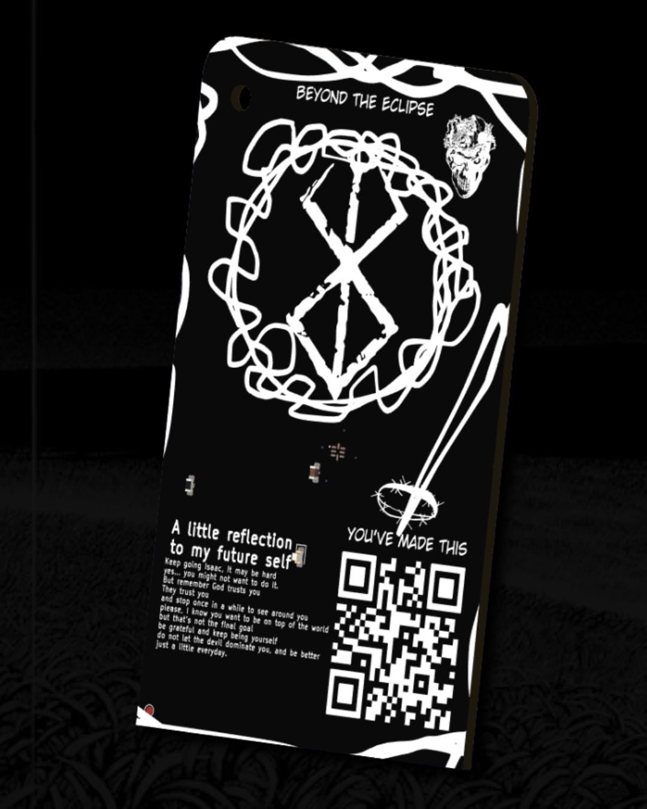
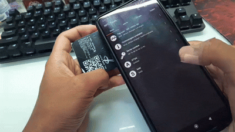
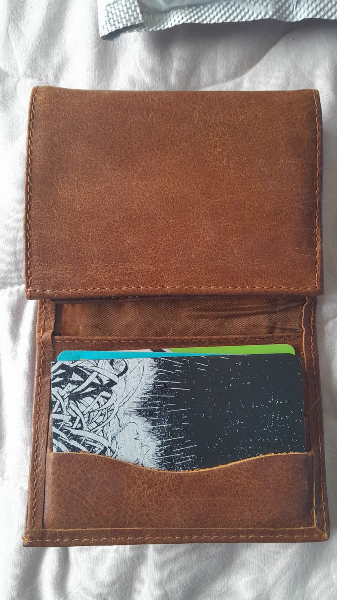
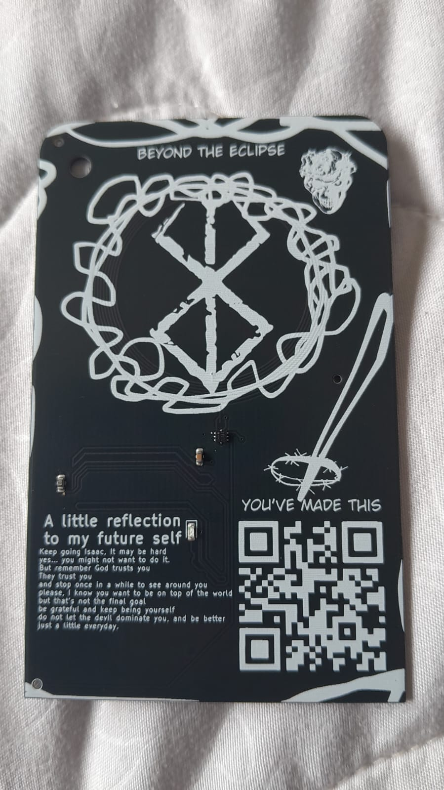
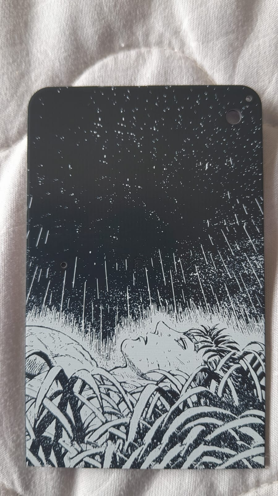
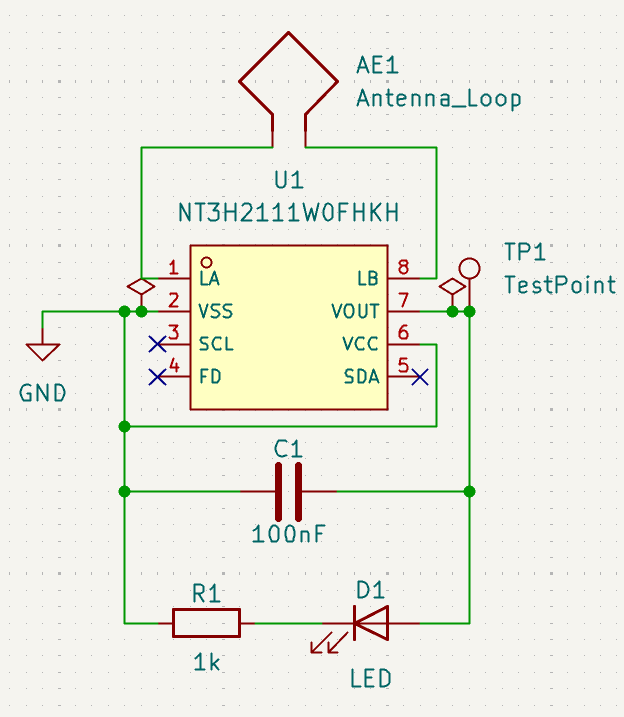
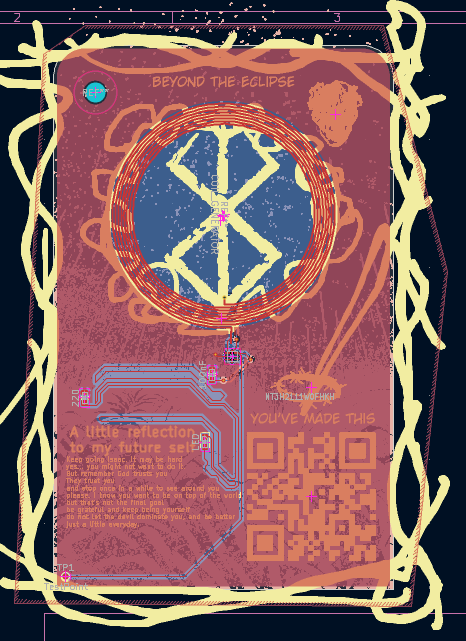
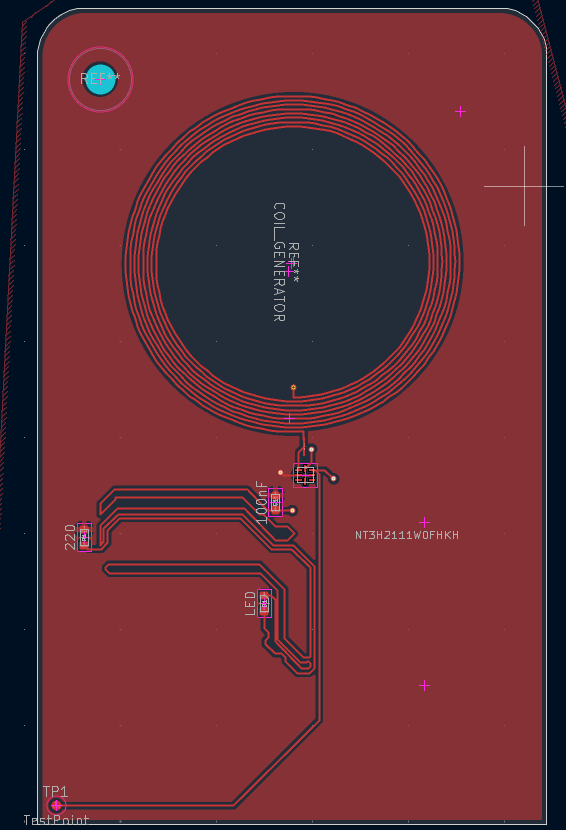
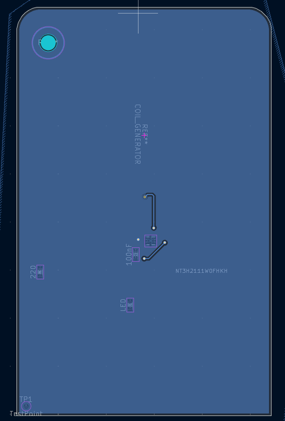
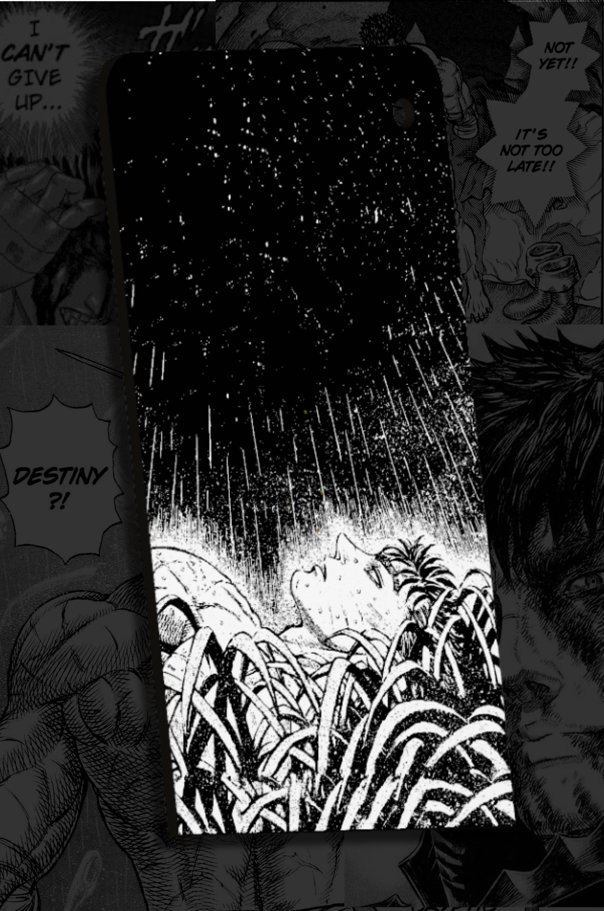

# The Branded One

*A tribute to Kentaro Miura's legacy.*

 

---

## Overview

A Berserk-themed NFC business card.
No battery.
No switches.
Powered entirely by your phone's NFC field.
Tap it and it opens my GitHub.

Built as a tribute to Guts' philosophy: **keep moving forward, no matter what.**

---

## The Tap

  

  <i>No battery. No switches. Just the phone's field.</i>

---

## In Real Life

  

  <i>The Branded One carried as it was meant to be.</i>

 

  
  

---

## The reason behind this project

> This project started with the Idea of showing a little bit of respect or give some honor for one of the most influencial characters in my adolescence, Gats or Guts or Gustavo in spanish, I wanted to do the business card, but It did not felt like me what can I say... I did not liked the Idea of a plain card, and is not useful Imo, so instead of a business card, why not a meaningfull memento, you see Guts really inspired me to keep going, probably thanks to what I read when I was younger I am who I am now, theres this quote of Guts that really hits me, it says...
>
> **I'm not going to die here.**
>
> to me it represents my hunger for not dying as a normal human being, everyday I try to do something to push me more, and its because I dont wanna be normal, and I started having sparks of this type of life, when Guts went out on a journey, leaving to become someone, thats when I thought,
>
> **Why am I not doing that...**
>
> thanks Guts, probably I will never see the ending of Berserk, but it did teach me to not give up, even when you dont think is worth it to try one more time, when you are worried about what will happen, you have to think the real reason you started, and in the process dont try to always be happy, just live because life is about living the present, not the past neither the future.
>
> **If Guts did not surrender, Why would you?**

---

## Schematic

  

---

## PCB

  

<table>
  <tr>
    <td width="50%"></td>
    <td width="50%"></td>
  </tr>
  <tr>
    <td align="center"><b>Front Copper</b></td>
    <td align="center"><b>Back Copper</b></td>
  </tr>
</table>

---

## Renders

<table>
  <tr>
    <td width="50%"></td>
    <td width="50%"></td>
  </tr>
  <tr>
    <td align="center"><b>Front</b></td>
    <td align="center"><b>Back</b></td>
  </tr>
</table>

---

## Bill of Materials

| Name | Purpose | Qty | Total Cost (USD) | Link |
| :--- | :--- | :---: | :---: | :--- |
| NT3H2111W0FHKH | NFC Controller | 1 | 0.62 | [LCSC](https://www.lcsc.com/product-detail/C710403.html) |
| Red LED 0603 | Status LED | 1 | 0.02 | [LCSC](https://www.lcsc.com/product-detail/C2286.html) |
| 1kΩ Resistor | LED Protection | 1 | 0.01 | [LCSC](https://www.lcsc.com/product-detail/C21190.html) |
| 100nF Capacitor | Decoupling Capacitor | 1 | 0.01 | [LCSC](https://www.lcsc.com/product-detail/C14663.html) |

---

## Special Thanks

To *三浦 建太郎*,
and to my family that allowed me to be here,
and also...

**STASIS <3333**
**Hack Club**

---

## You might also like

- [The Dichotomy Split](https://github.com/Cocotrilito/The-Dichotomy-Split)
- [Voyager Panel](https://github.com/Cocotrilito/Voyager-Panel)
- [Chimborazo Stratos-1](https://github.com/Cocotrilito/Chimborazo-Stratos-1)

---

## Final thanks

To me,
thanks for surviving every night,
even with the brand.
Thanks for fighting back,
and for not giving up on the Idea of changing our destiny.

> **"I'm not going to die here."**
>
> — *Guts*
